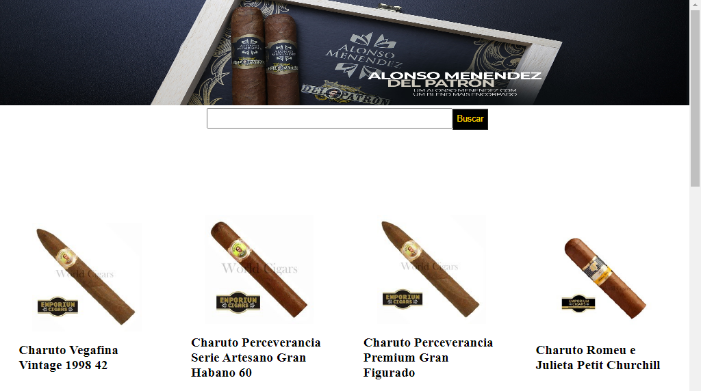
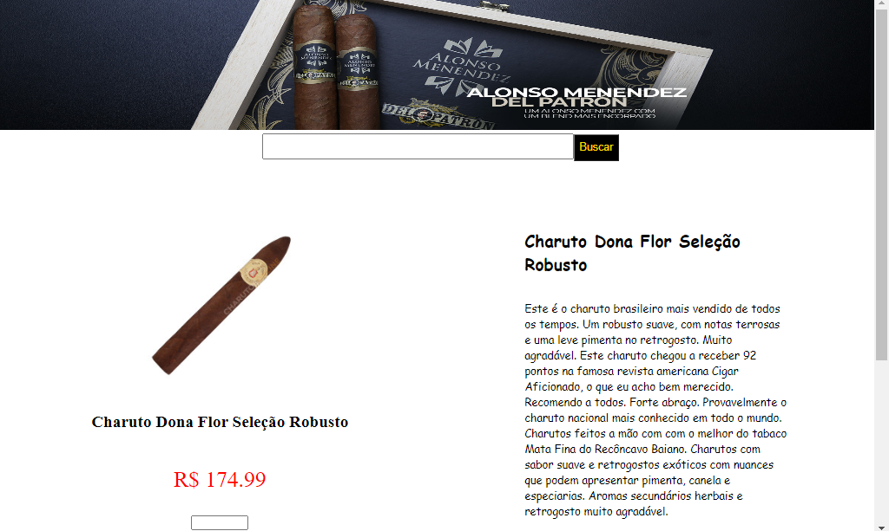
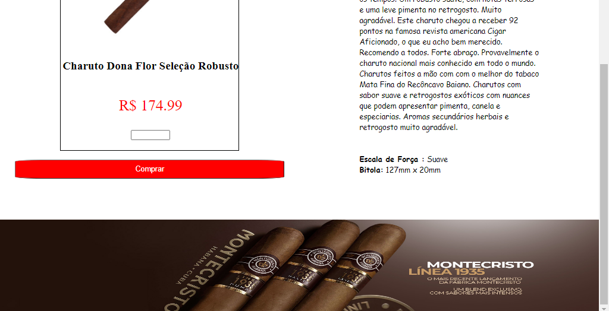

<h1 > <u> CHARUTARIA </u> </h1>

<h4>Veja imagens do projeto: </h4>

 
 
imagem1 

 
 
 
imagem2 
         

 
 
 
imagem3 
     

 
 
 
imagem4 
     

 
 
 
imagem5 
     

<h2>Feito com: </h2>

